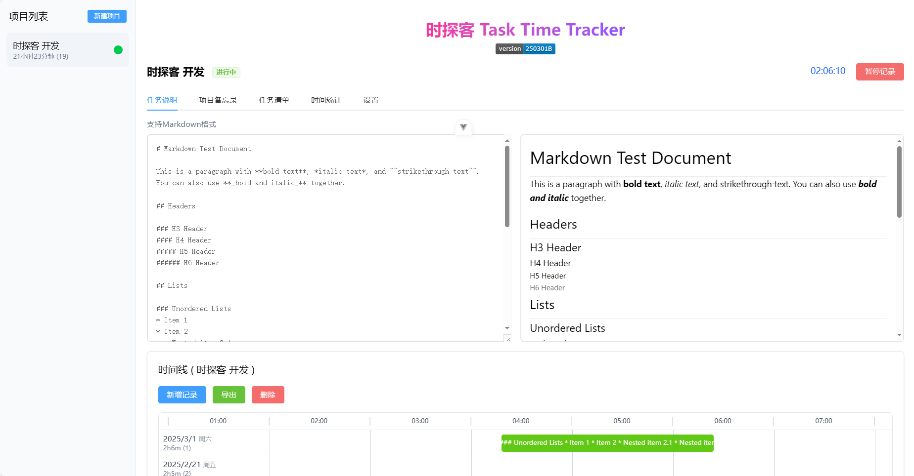
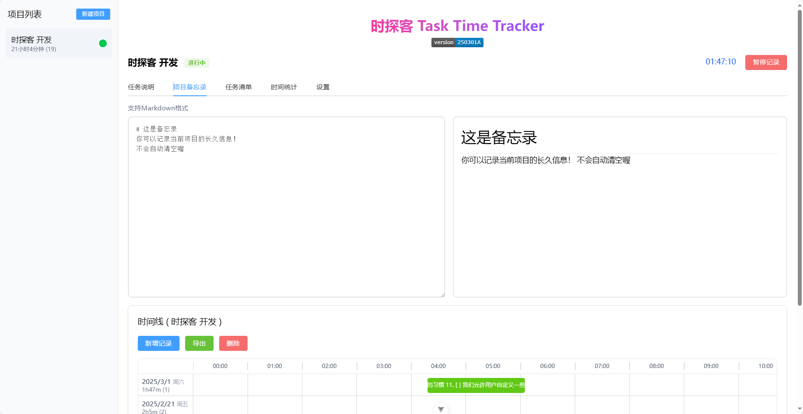
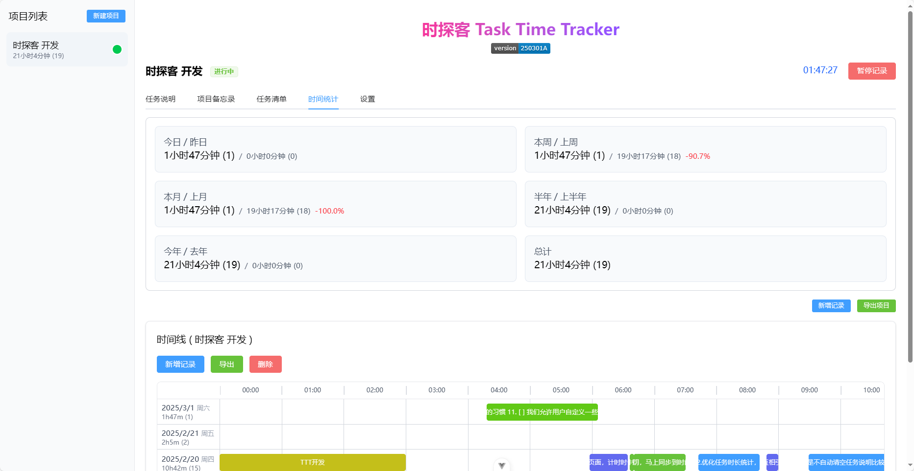
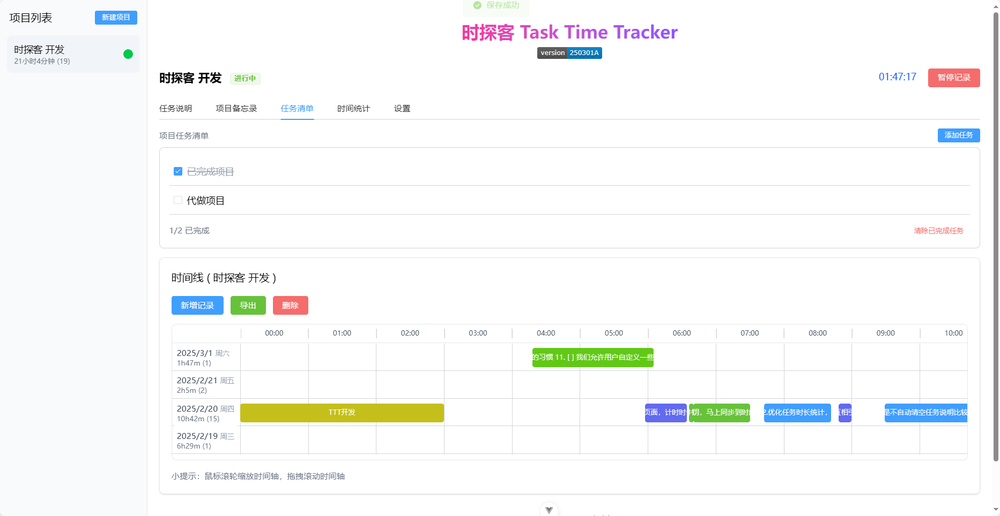

# Task Time Tracker


English | [简体中文](README_CN.md)

A simple and user-friendly personal project time tracking tool to help you record and manage time spent on various tasks through visual timelines and detailed statistics.

[Live Demo](https://createskyblue.github.io/Task-Time-Tracker/)

## Features

- 🕒 Real-time time tracking
- 📊 Visual timeline display
- 🎨 Automatic color coding for different time periods
- 📝 Support for Markdown formatted task descriptions and project memos
- ✅ Project task list management
- 🔄 Multi-tab data synchronization
- 💾 Auto-save with import/export capabilities
- 🖱️ Intuitive timeline zoom and drag

## Latest Updates (250301A)

### New Tab-Based Interface
- **Complete Tab Navigation**: All functionality integrated into a tabbed interface
  - Task Description - Markdown editing with live preview
  - Project Memo - Markdown-supported project notes
  - Task List - Project-related to-do items management
  - Time Statistics - Detailed time usage statistics
  - Settings - Project and application settings

### Task List Functionality
- To-do list for each project
- Add, edit, mark as complete, and delete tasks
- Display completion progress and clear completed tasks

### Multi-Tab Support
- Detect multi-tab editing conflicts
- Automatic data synchronization for data consistency
- User-friendly update notifications

### UI Improvements
- Side-by-side Markdown editing and preview
- Real-time Markdown rendering
- Improved timeline view with date and work duration statistics

## Interface Preview

### Task Description


### Memo


### Time Statistics


### To-do List


### Timeline


## Key Features

### Task Management
- Create, rename, and delete tasks
- Double-click task name for direct editing
- Add detailed Markdown-formatted descriptions
- Task list functionality for project progress management

### Time Recording
- One-click start/stop timing
- Track multiple tasks simultaneously
- Automatic color assignment for time periods
- Detailed time statistics (day/week/month/year)
- Cumulative time statistics by color

### Timeline View
- Intuitive time distribution display
- Mouse wheel timeline zoom
- Drag to pan timeline
- Click time blocks to edit details

### Data Management
- Local auto-save (safe even if browser closes)
- JSON format import/export
- Multi-tab data synchronization
- Automatic backup before deletion

## Tech Stack

- Vue 3
- Element Plus
- TailwindCSS
- Marked (Markdown parsing)

## Getting Started

```bash
# 安装依赖
npm install

# 开发环境运行
npm run dev

# 构建生产版本
npm run build

```

## 🚀 Professional Development Services

### 🔍 Core Business Areas

**💻 Smart Hardware Development Expert**
- Full-stack embedded systems development (Low-power 4G IoT/Industrial Modbus Gateway/HarmonyOS & LiteOS Integration)
- Industrial edge computing solutions (Data collection/Protocol conversion/Cloud connectivity)
- Smart terminal customization (BLE/NFC/WiFi multi-mode communication)

**🌐 Full-spectrum Software Development**
- Industrial HMI development (QT cross-platform/Web)
- Web full-stack development (Vue3/Spring Boot backend/Mini Programs)

**📑 Professional Documentation Services**
- Technical solution documentation
- Patent application materials

### 🏆 Team Advantages
PhD-led R&D team | 10+ years industry experience | End-to-end project management

### ⚙️ Standardized Service Process
1. **Requirement Analysis** - Technical feasibility report + Dedicated contact
2. **Solution Design** - Prototype design + Feature list confirmation + Contract signing
3. **Delivery Assurance** - Stress testing + Source code transfer + On-site maintenance support

### 📬 Contact Us
**Technical Consultant Email**: createskyblue@outlook.com  
**Email Format**: `[Project Inquiry] + Industry Domain + Budget Range`  
**Response Promise**: 24/7 response including late hours