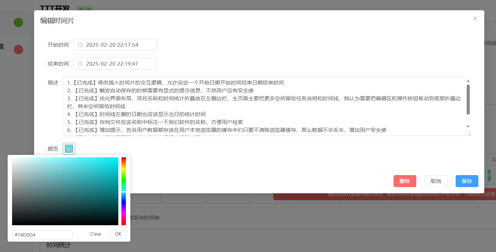
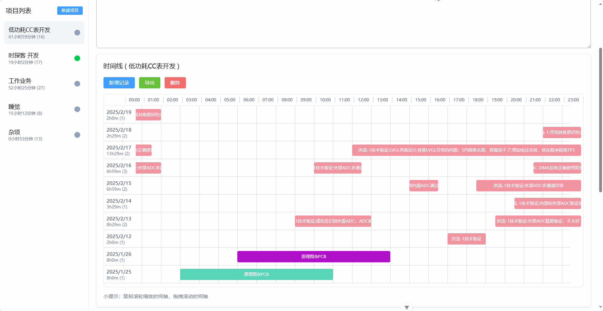

# 时探客 Task Time Tracker

一个简洁而强大的3A大作时间追踪工具，帮助你记录和管理各项任务的时间投入。做这个项目的目的是探索AI淘金热，放手让AI编程。

## 功能特点

- 🕒 实时计时功能
- 📊 可视化时间线展示
- 🎨 自动颜色区分不同时间段
- 📝 支持任务说明和时间事件备注
- 💾 自动保存，支持导入导出
- 🖱️ 直观的时间轴缩放和拖拽

## 界面预览

### 主界面


### 时间事件编辑


### 时间线



## 主要功能说明

### 任务管理
- 创建、重命名、删除任务
- 双击任务名称可直接编辑
- 点击任务行可查看详细时间线

### 时间记录
- 一键开始/结束计时
- 对多个任务同时计时
- 强制要求添加任务说明注释，确保工作记录必须要留痕 \\(😭)/\(😭)/\(😭)/✍🏻✍🏻✍🏻✍🏻✍🏻✍🏻
- 实时显示计时状态
- 自动为时间段分配颜色
- 相同颜色累计时间统计

### 时间线视图
- 直观展示时间分布
- 鼠标滚轮缩放时间轴
- 拖拽平移时间轴
- 点击时间块编辑详情

### 数据管理
- 本地自动保存（计时中途关闭浏览器也没问题！）
- JSON格式导入导出
- CSV格式导出单任务
- 删除数据时很贴心地先自动导出

## 技术栈

- Vue 3
- Element Plus
- TailwindCSS
- Vite

## 开始使用

```bash
# 安装依赖
npm install

# 开发环境运行
npm run dev

# 构建生产版本
npm run build

```

## 广告时间

- **B站**: [点击这里](https://space.bilibili.com/29231553?spm_id_from=333.1365.0.0)
- **嘉立创开源社区**: [点击这里](https://oshwhub.com/createskyblue/works)
- **嘉立创硬创社**: [点击这里](https://x.jlc.com/platform/userCenter/r%C3%89%C2%B5%C2%90%C2%8C%C2%B3%C3%A3%C2%B3%C2%8B%C2%9B%C2%BA%C3%8A%C3%8E%C3%A1%C3%87%C2%87%C3%96%C3%8E%C2%BC%C2%99%C2%B5%C2%BD%C2%8Ez)
  
- 团队承包嵌入式软硬件开发项目（低功耗物联网、Modbus网关）
- 软件开发（QT上位机、Web上位机、网站）
- 小程序开发等开发服务

流程：
1. 需求评估
2. 合同签约
3. 开发测试
4. 交付