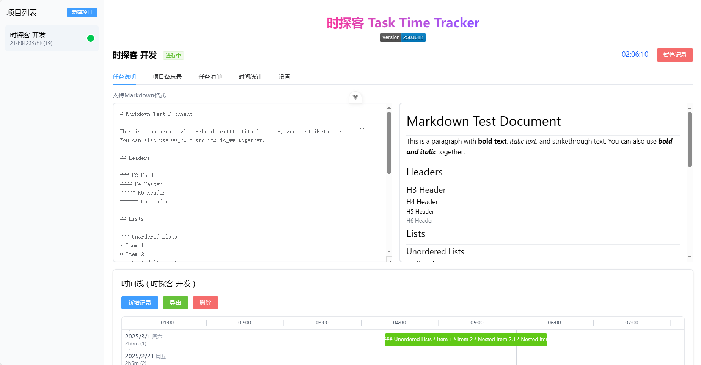
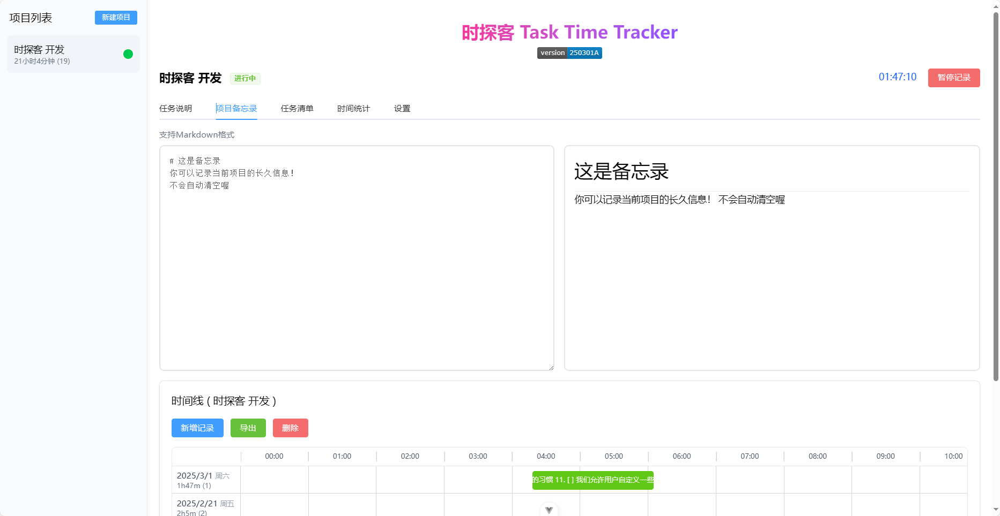
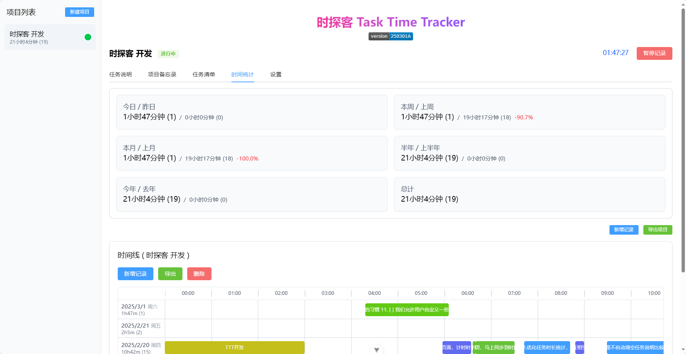
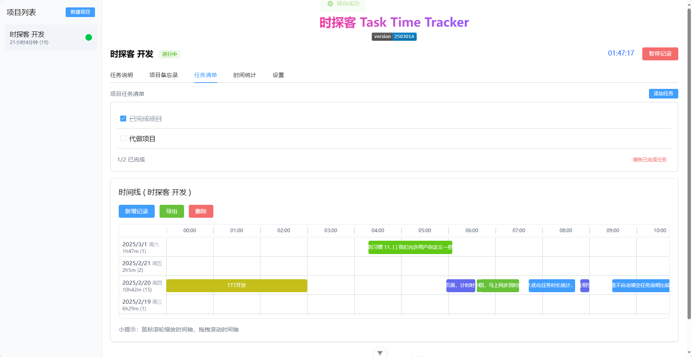

# 时探客 Task Time Tracker


简体中文 | [English](README.md)

一个简洁易用的个人项目时间追踪工具，帮助你记录和管理各项任务的时间投入。通过可视化时间线和详细的统计功能，让你对工作时间一目了然。

[在线体验](https://createskyblue.github.io/Task-Time-Tracker/)

## 功能特点

- 🕒 实时计时与追踪
- 📊 可视化时间线展示
- 🎨 自动颜色区分不同时间段
- 📝 支持Markdown格式的任务说明和项目备忘录
- ✅ 项目任务清单管理
- 🔄 多标签页数据同步
- 💾 自动保存与导入导出
- 🖱️ 直观的时间轴缩放和拖拽操作

## 最新更新 (250301A)

### 全新标签式界面
- **完整的标签栏导航**: 将所有功能整合到标签式界面中
  - 任务说明 - Markdown格式的即时编辑与预览
  - 项目备忘录 - 支持Markdown的项目相关笔记
  - 任务清单 - 管理项目相关的待办事项
  - 时间统计 - 查看详细的时间使用情况
  - 设置 - 项目和应用程序设置

### 任务清单功能
- 为每个项目添加待办事项列表
- 支持添加、编辑、标记完成和删除任务
- 显示完成进度并可一键清理已完成任务

### 多标签页支持
- 检测多标签页编辑冲突
- 自动同步数据，确保数据一致性
- 用户友好的更新提示

### 用户界面优化
- 并排Markdown编辑与预览
- 实时渲染Markdown内容
- 优化的时间线视图，包括日期和工作时长统计

## 界面预览

### 主界面


### 备忘录


### 时间统计


### 主界面


### 代办事项


### 时间线


## 主要功能

### 项目管理
- 创建、重命名和删除项目
- 双击项目名称可直接编辑
- 为项目添加详细的Markdown格式说明
- 任务清单功能帮助项目进度管理

### 时间记录
- 一键开始/结束计时
- 多项目同时计时
- 自动颜色标记不同时间段
- 详细的时间统计（日/周/月/年）
- 相同颜色累计时间统计

### 时间线视图
- 直观展示时间分布
- 鼠标滚轮缩放时间轴
- 拖拽平移时间轴
- 点击时间块编辑详情

### 数据管理
- 本地自动保存（浏览器关闭也安全保存）
- JSON格式导入导出
- 多标签页自动数据同步
- 删除数据时自动备份

## 技术栈

- Vue 3
- Element Plus
- TailwindCSS
- Marked (Markdown解析)

## 快速开始

```bash
# 安装依赖
npm install

# 开发环境运行
npm run dev

# 构建生产版本
npm run build

```

## 🚀 广告时间！ 专业研发服务 助力智能未来

### 🔍 核心业务领域

**💻 智能硬件开发专家**
- 嵌入式系统全栈开发（低功耗4G物联网/工业Modbus网关/鸿蒙&LiteOS深度适配）
- 工业级边缘计算解决方案（数据采集/协议转换/设备上云）
- 智能终端定制开发（BLE/NFC/WiFi多模通信方案）

**🌐 软件全场景开发**
- 工业上位机开发（QT跨平台/Web）
- Web全栈开发（Vue3/Spring Boot后端/小程序）

**📑 专业文书服务**
- 技术方案书撰写
- 专利申报材料编制

### 🏆 团队优势
博士领衔研发团队 | 10+年行业经验 | 全流程项目管理

### ⚙️ 标准化服务流程
1. **需求深挖** - 技术可行性分析报告 + 专人对接
2. **方案定制** - 原型设计+功能清单确认+合同签约
2. **交付保障** - 压力测试+源码移交+现场运维支持

### 📬 开启智慧合作
**技术顾问邮箱**：createskyblue@outlook.com  
**邮件规范**：`[项目咨询] + 行业领域 + 预算范围`  
**响应承诺**：7*24小时内响应 包括深夜
